# Fusion Neutronics workshop with OpenMC
A selection of resources for learning OpenMC with particular focus on simulations relevant to fusion energy.

There are a few [slides](https://slides.com/openmc_workshop/neutronics_workshop) that introduce the workshop and show the expected outputs of each task.

The use of OpenMC for neutronics analysis requires several software packages and nuclear data. These have been installed inside a Docker container.
**It is recommended that this workshop be completed using the Docker container.**

The majority of the workshop can also be completed using Google Colab Notebooks which do not require the Docker container. The links to these notebooks are provided below. (NOTE - Not all tasks can be completed in Colab as it lacks some dependencies).
To use Google Colab you will need your own Google account. You can edit and save your own copies of each notebook to your Google Drive.

### Docker Installation

The installation process consists of two steps.

1. Install Docker CE [windows](https://store.docker.com/editions/community/docker-ce-desktop-windows/plans/docker-ce-desktop-windows-tier?tab=instructions), [linux](https://docs.docker.com/install/linux/docker-ce/ubuntu/), [mac](https://store.docker.com/editions/community/docker-ce-desktop-mac).
2. Pull the Docker image from the store by typing the following command in a terminal window.

```docker pull openmcworkshop/openmc_nndc_workshop```

### Running OpenMC with docker

Now that you have the Docker image you can enable graphics linking between your os and docker and then run the docker container by typing the following commands in a terminal window.

```xhost local:root```

```docker run --net=host -it --rm -v /tmp/.X11-unix:/tmp/.X11-unix  -v $PWD:/my_openmc_workshop -e DISPLAY=unix$DISPLAY --privileged openmcworkshop/openmc_nndc_workshop```

This should load up an Ubuntu 18.04 Docker container with OpenMC, Python3, Paraview, nuclear data and other libraries.

You can quickly test the graphics options worked by typing ```paraview``` in the docker container enviroment. This should open the paraview program.

Running the docker container places you in the ```/openmc_workshop``` directory which contains all of the files required to complete the workshop.

The docker container also contains a folder called ```/my_openmc_workshop``` which is mapped to the local directory from which you ran the container. Placing files into this directory allows you to tranfer files from your docker container to your local machine.

**IMPORTANT:** The docker container is built from an image at a particular moment in time. Any changes you make will be lost as soon as you exit the container. **Make sure you copy any files you want to keep into the ```my_openmc_workshop``` folder before exiting the docker container**. This places those files into the directory from which the docker container was run on your local machine.

### Getting started on the tasks

- [Task 1 - Cross section plotting](#task1)
- [Task 2 - Building and visualizing the model geometry](#task2)
- [Task 3 - Visualizing neutron tracks](#task3)
- [Task 4 - Finding the neutron flux](#task4)
- [Task 5 - Finding the neutron and photon spectra](#task5)
- [Task 6 - Finding the tritium production](#task6)
- [Task 7 - Finding the neutron damage](#task7)
- [Task 8 - Survey breeder blanket designs for tritium production](#task8)
- [Task 9 - Optimize a breeder blanket for tritium production](#task9)
- [Task 10 - Using CAD geometry](#task10)

&ensp; 
## --------------------------------------------------------------------------------------------------------------
&ensp;

### <a name="task1"></a>Task 1 - Cross section plotting

If using Colab, use the following link: [Task_1](https://colab.research.google.com/drive/1Z5C7bxX-1iPjBfhDrgIzGVaTyfI2CdFa)

Please allow 20 minutes for this task.

Expected outputs from this task are also in the [presentation](https://slides.com/openmc_workshop/neutronics_workshop/#/13).

Knowing the interaction probabilities of isotopes and materials within your model can help you understand the simulation results. There are several online tools for plotting nuclear cross sections such as [XSPlot](http://xsplot.com). However, OpenMC is also able to plot cross sections for isotopes and materials.

From inside the docker container navigate to the task_1 directory and open the first example python script.

```cd tasks/task_1```

```coder 1_example_isotope_plot.py```

OpenMC is well documented so if the script does not make sense take a look at the relevant [documentation](https://openmc.readthedocs.io/en/v0.10.0/examples/nuclear-data.html). This script will plot the cross sections of certain reactions for a selection of isotopes.

```python3 1_example_isotope_plot.py```

You should see a plot of the n,2n cross sections for isotopes of lead and beryllium, as shown below.

<p align="center">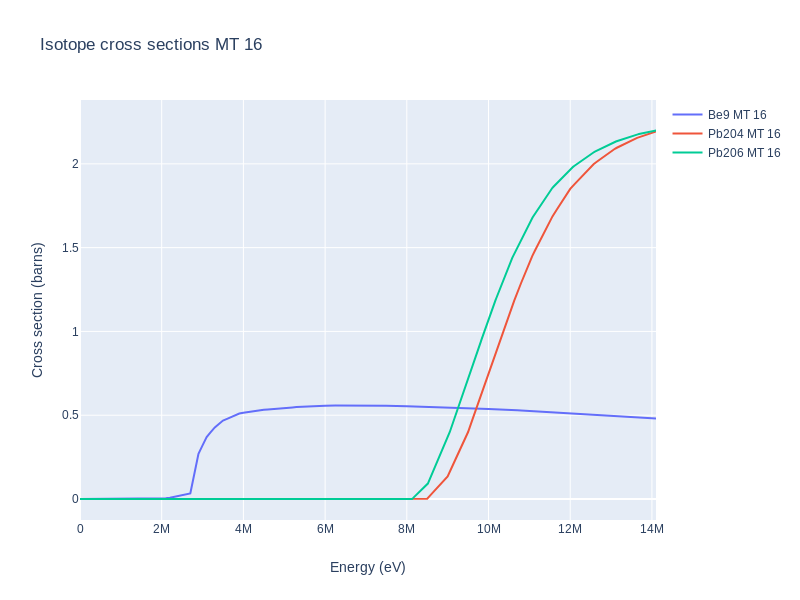</p>

To add different reactions to the plot we would need their ENDF reaction numbers (MT number) which are available [here](https://www.oecd-nea.org/dbdata/data/manual-endf/endf102_MT.pdf).

- Try adding the other lead isotopes to the plot.

- Try adding tritium production in Li6 and Li7 to the same plot.

The plot should now be similar to the plot below showing fusion relevant interactions. These are important reactions for breeder blankets as they offer high probability of neutron multiplication and tritium production.

<p align="center"></p>

- Try editing ```1_example_isotope_plot.py``` so that it plots tritium production or neutron multiplication for all the stable isotopes.

Elemental properties can also be found with OpenMC. Try plotting tritium production and neutron multiplication using the ```2_example_element_plot.py``` script and the following commands.

```coder 2_example_element_plot.py```

```python3 2_example_element_plot.py```

This should produce a plot similar to as shown below.

<p align="center"></p>

A nice feature of OpenMC is that it can plot cross sections for more complete materials made from combinations of isotopes. Open the ```3_example_material_plot.py``` script and edit it so that it can plot the tritium production and use this to identify the best elements for tritium production and neutron production. Why might we want to avoid some of these elements?

The script shows us how to plot tritium production in Li4SiO4 which is a candidate ceramic breeder blanket material. Running this script should produce a plot as shown below.

<p align="center">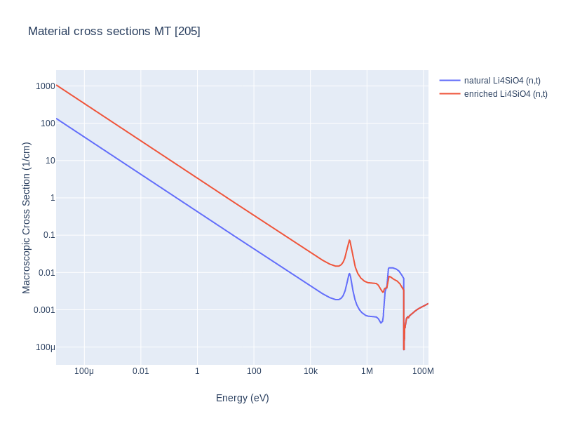</p>

 - Try editing ```3_example_material_plot.py``` so that other candidate breeder materials are added to the plot.

&ensp; 
## --------------------------------------------------------------------------------------------------------------
&ensp; 

### <a name="task2"></a>Task 2 - Building and visualizing the model geometry.

If using Colab, use the following link : [Task_2](https://colab.research.google.com/drive/17o94Go2_pQLHrrkcM_2K-asvKrSsMbtx)

Please allow 20 minutes for this task.

Expected outputs from this task are also in the [presentation](https://slides.com/openmc_workshop/neutronics_workshop/#/14).

OpenMC can provide both 2D and 3D visualizations of the Constructive Solid Geometry ([CSG](https://en.wikipedia.org/wiki/Constructive_solid_geometry)).
There are two methods of producing 2D slice views of the geometry.

The first example 2D slice plot can be opened and produced using the following commands inside the task_2 folder.

```coder 1_example_geometry_viewer_2d_fortran_version.py```

```python3 1_example_geometry_viewer_2d_fortran_version.py```

Views of the simple model from different planes (XY, XZ, YZ) should appear, as shown below.

 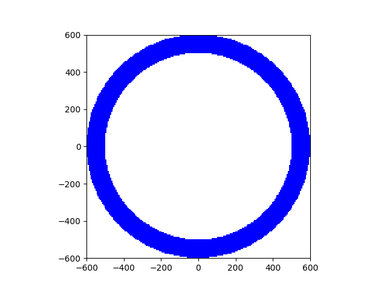 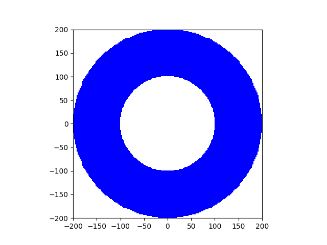
<p align="center"><i>Left = XY plane, Middle = XZ plane, Right = YZ plane</i></p>

As the geometry is a simple spherical shell centred at the origin, its views in each plane are identical.

The second method of producing 2D slice plots works better for large models.

```coder 2_example_geometry_viewer_2d.py```

```python3 2_example_geometry_viewer_2d.py```

Edit the script and try adding a first wall and central column to the model using the OpenMC [simple examples](https://openmc.readthedocs.io/en/stable/examples/pincell.html#Defining-Geometry) and the [documentation](https://openmc.readthedocs.io/en/stable/usersguide/geometry.html) for CSG operations.

- Try adding a 20cm thick first wall to the hollow sphere.

- Try adding a centre column with a 100cm radius.

- Try creating a material from pure copper and assign it to the central column.

- Try creating a homogenized material from 10% water and 90% tungsten and assign it to the first wall and the shield.

- Colour the geometry plots by material - see the [documentation](https://openmc.readthedocs.io/en/stable/usersguide/plots.html) for an example.

By the time you have added you extra geometry components your solution should look similar to the geometry contained in the next example script.

```coder 3_example_geometry_viewer_2d_tokamak.py```

```python3 3_example_geometry_viewer_2d_tokamak.py```

Running this script, views of the tokamak model from different planes (XY, XZ, YZ) should appear, as shown below.

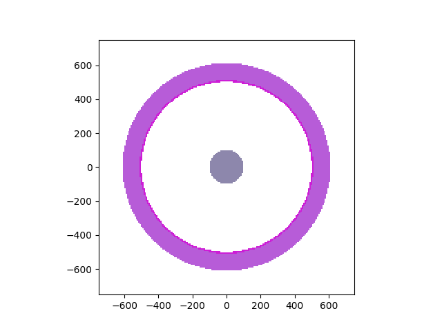 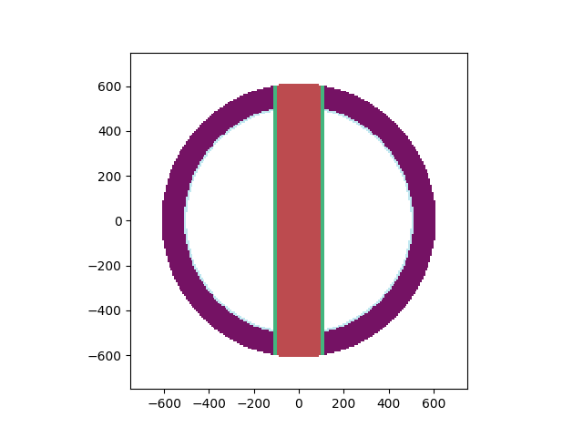 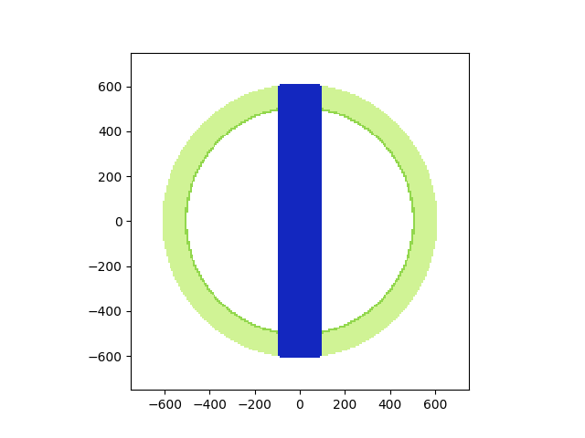
<p align="center"><i>Left = XY plane, Middle = XZ plane, Right = YZ plane</i></p>

The next example script shows a simple geometry that can be viewed in 3D using paraview. This converts the geometry into a block.

```coder 4_example_geometry_viewer_3d.py```

```python3 4_example_geometry_viewer_3d.py```

Paraview should load up when this script completes. To make the geometry visible click the "Apply" button and also the small eyeball icon on the left hand side. Then select "id" and "surface" in the dropdown menus to view the geometry. The threshold and slice operations can then be used to view specific parts of the geometry we are interested in. A video tutorial is also provided below.

- Try using the paraview threshold operation to remove the vacuum cell. Set the threshold to 0 then click the "Apply" button.

- Try combining the last two scripts so that you can visualize the tokamak model in 3D.

```coder 5_example_geometry_viewer_3d_tokamak.py```

```python3 5_example_geometry_viewer_3d_tokamak.py```

**Paraview Video Tutorial**

<a href="http://www.youtube.com/watch?feature=player_embedded&v=VWjQ-iHcaxA
" target="_blank">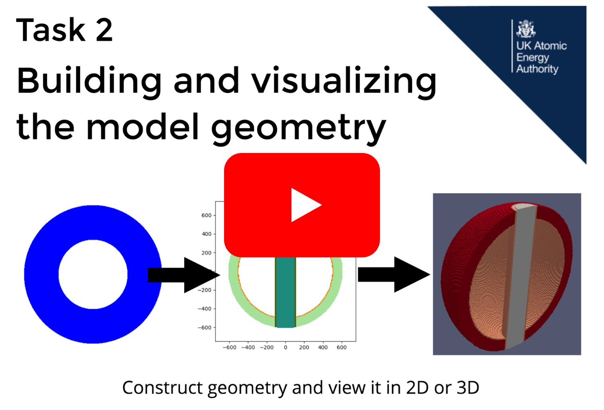</a>

&ensp; 
## --------------------------------------------------------------------------------------------------------------
&ensp; 

### <a name="task3"></a>Task 3 - Visualizing neutron tracks

If using Colab, use the following link : [Task_3](https://colab.research.google.com/drive/1kOFp9s3utX0o2D7llXXJ6pyyrvK_V-Nz)

Please allow 20 minutes for this task.

Expected outputs from this task are also in the [presentation](https://slides.com/openmc_workshop/neutronics_workshop/#/15).

When OpenMC runs, a statepoint (output) file is produced which contains information about the neutron source, tally results and additional information. This task focuses on extracting neutron source information from the statepoint file, while tasks 4, 5 and 6 focus on extracting other information from the statepoint file.

The ```1_plot_neutron_birth_energy.py``` file shows you how to access the statepoint file created by a simulation. In this example the birth energy of all the simulated neutrons is extracted. A plot of the energy distribution can be produced by running the script.

```python3 1_plot_neutron_birth_energy.py```

The script will produce a plot of a mono-energetic energy source of 14 MeV neutrons, as shown below.

<p align="center">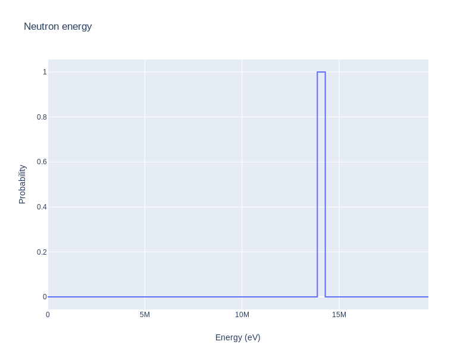</p>

There are actually three source energy distributions available in the ```1_plot_neutron_birth_energy.py``` script.

- Try plotting the Watt and Muir neutron spectra and compare them to the mono-energetic source.

- Try changing the Muir plasma temperature from 20 KeV to 40 KeV.

In the next example the initial neutron trajectory and birth location is plotted. Again, this information is accessed from the statepoint file.

Run ```python3 2_plot_neutron_birth_location.py``` to produce plots of a basic point source showing neutron birth locations and initial directions. The output of which should look similar to the plots shown below.

<p align="center"> </p>

<p align="center"><i>Left = Neutron birth locations, Right = Neutron initial directions</i></p>

Now open the next example source plotting script ```3_plot_neutron_birth_locations_plasma.py```. Look for the part in the script where the source is defined - you should notice that an external source library is used. The ```source_sampling.so``` file is a precompiled plasma source file containing neutron positions, energies and directions for a given plasma source. This file is in task_3 directory.

Run ```python3 3_plot_neutron_birth_locations_plasma.py``` to produce the plot of a more realisitc plasma neutron source point. The output of which should look similar to the plots shown below.

<p align="center">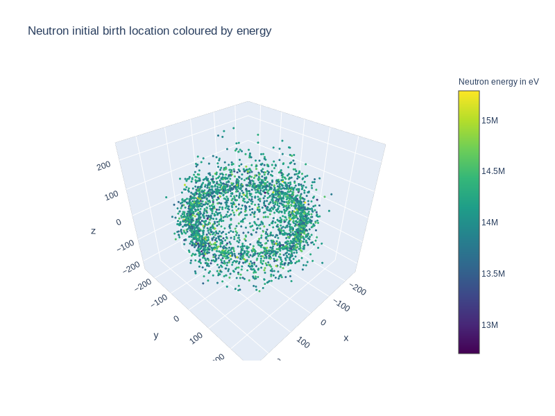 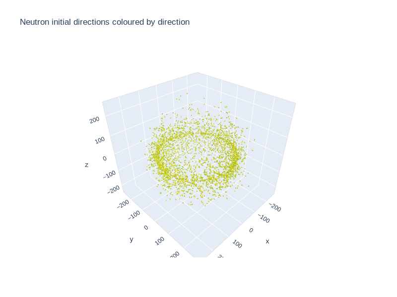</p>

<p align="center"><i>Left = Neutron birth locations, Right = Neutron initial directions</i></p>

The ```4_example_neutron_tracks.py``` file contains a hollow sphere made of two materials and a 14 MeV point source in the centre of the geometry. The objective of this task is to create some 3D particle tracks and visualize them with the geometry.

Open up ```coder 3_example_neutron_tracks.py``` and take a look at the ```model.run(tracks=True)``` method. This argument results in the creation of a h5 file for each neutron simulated.

Run the script with the command
```python3 3_example_neutron_tracks.py```

Use Paraview to load the geometry file and then open the track files (.vtp files). Parview can also be used to slice (slice this model on the z plane) and threshold the geometry. Looking at the tracks can you tell which material is water and which is zirconium?

&ensp; 
## --------------------------------------------------------------------------------------------------------------
&ensp; 

### <a name="task4"></a>Task 4 - Finding the neutron flux

If using Colab, use the following link : [Task_4](https://colab.research.google.com/drive/1TVgCaEU_GAnJziNuyDFEvDfFYLU-fQaJ)

Please allow 15 minutes for this task.

Expected outputs from this task are also in the [presentation](https://slides.com/openmc_workshop/neutronics_workshop/#/16).

In this task mesh tallies will be produced and visualized.

The ```example_neutron_flux.py``` file contains a single material, simple hollow sphere geometry, a 14 MeV point source and a mesh tally showing neutron flux. Try running this file.

```python3 example_neutron_flux.py```

You should see the isotropic point source appearing along with the simple sphere geometry, as shown below. The colour map shows the neutron flux reducing as one moves away from the point source.

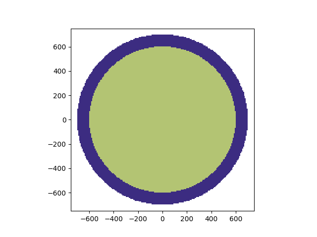 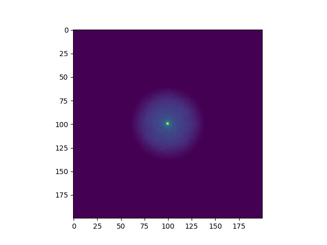

<p align="center"><i>Left = Geometry Plot, Right = Flux Plot</i></p>

- Try changing the "flux" tally for an "absorption" tally and re-run the simulation with the same command.

- Try changing the Li6 enrichment of the material and compare the absorption of neutrons with the natural Li6 enrichment.

There is another example neutron flux file with the simple tokamak geometry. Take a look at the ```example_neutron_flux_tokamak.py``` scritp and run it with the command

```python3 example_neutron_flux_tokamak.py```

The model still has a point source but now it is located at x=150 y=0 z=0 and central column shielding is noticeable on the flux, absorption and tritium production mesh tallies, as shown below.

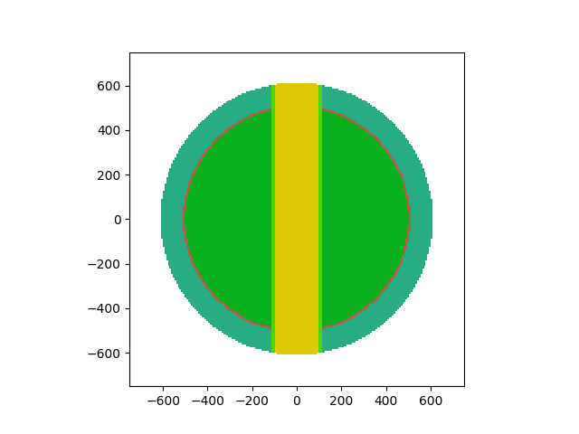 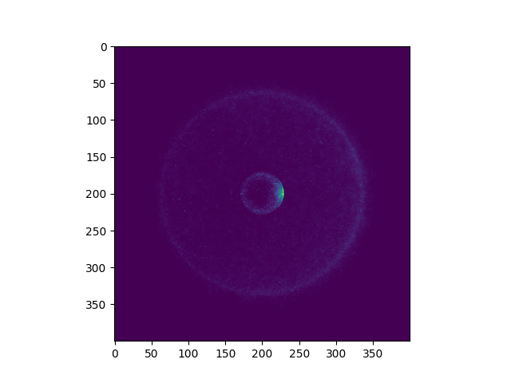

<p align="center"><i>Left = Tokamak Geometry Plot, Right = Tokamak Flux Plot</i></p>

- Try changing the mesh tally from (n,t) to flux and absorption.

&ensp; 
## --------------------------------------------------------------------------------------------------------------
&ensp; 

### <a name="task5"></a>Task 5 - Finding the neutron and photon spectra

If using Colab, use the following link : [Task_5](https://colab.research.google.com/drive/1piuEmG09E9kfkFTw2WZV6TdX_xovqmVj)

Please allow 15 minutes for this task.

Expected outputs from this task are in the [presentation](https://slides.com/openmc_workshop/neutronics_workshop/#/18).

In this task the neutron spectra at two different locations will be found and visualized.

Open ```1_example_neutron_spectra_tokamak.py``` to see how the neutron spectra is obtained for the breeder blanket cell. You might notice that OpenMC has energy group structures such as VITAMIN-J-175 and [others](https://github.com/openmc-dev/openmc/blob/develop/openmc/mgxs/__init__.py) built in which makes the energy grid easy to define.

Run ```1_example_neutron_spectra_tokamak.py``` to plot the neutron spectra within the breeder blanket.

```coder 1_example_neutron_spectra_tokamak.py```

```python3 1_example_neutron_spectra_tokamak.py```

The plot should look similar to the plot shown below.

<p align="center">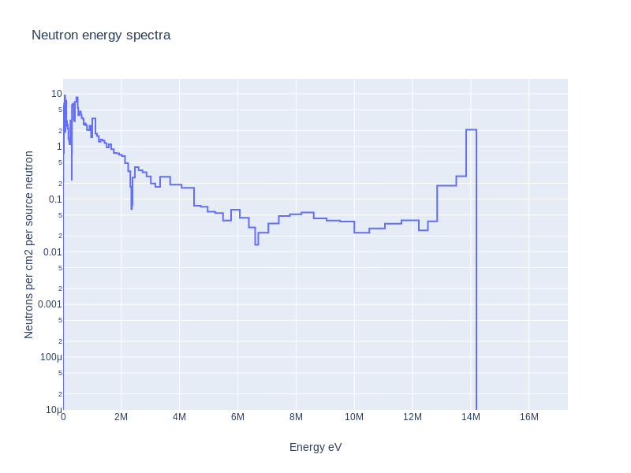</p>

- Try plotting the neutron spectra within the first wall cell on the same axis and compare it to the breeder blanket cell.

Open ```2_example_photon_spectra_tokamak.py``` to see how the photon spectra is obtained for the breeder blanket cell. An additional setting is required to enable photon transport (which is disabled by default). Then run the script to plot the photon spectra within the breeder blanket.

```coder 2_example_photon_spectra_tokamak.py```

```python3 2_example_photon_spectra_tokamak.py```

The plot should look similar to the plot below.

<p align="center">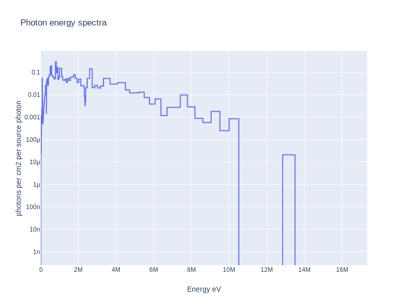</p>

&ensp; 
## --------------------------------------------------------------------------------------------------------------
&ensp; 

### <a name="task6"></a>Task 6 - Finding the tritium production

If using Colab, use the following link : [Task_6](https://colab.research.google.com/drive/188lPNZP_3clN1kC-nlJgI4HBMaSXKu5t)

Please allow 15 minutes for this task.

Expected outputs from this task are in the [presentation](https://slides.com/openmc_workshop/neutronics_workshop/#/19).

In this task you will find the tritium breeding ratio (TBR) for a single tokamak model using ```example_tritium_production.py``` and then the TBR values for a range of tokamak models with different Li6 enrichment values with the ```example_tritium_production_study.py``` script.

Open and run the ```example_tritium_production.py``` script using the following commands.

```coder example_tritium_production.py```

```python3 example_tritium_production.py```

The example script prints the TBR and the associated error. As you can see the error is high.

- Try increasing the number of ```batches``` and the ```sett.particles``` and re-run the simulation. You should observe an improved estimate of TBR.

Your should find that the TBR value obtained from the improved simulation is below 1.0 so this design will not be self sufficient in fuel.

One option for increasing the TBR is to increase the Li6 content within the blanket. Open and run the next script and see how TBR changes as the Li6 enrichment is increased.

```coder example_tritium_production_study.py```

```python3 example_tritium_production_study.py```

The script should produce a plot of TBR as a function of Li6 enrichment, as shown below.

<p align="center">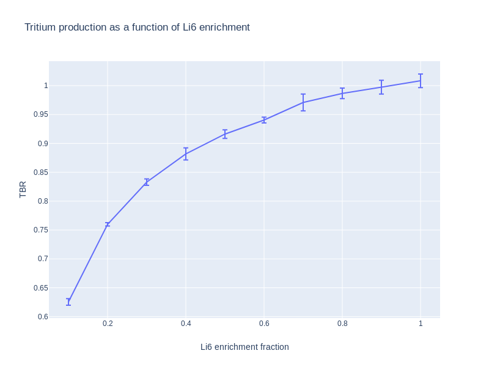</p>

- Try changing '(n,t)' to 205 and you should get the same result as this is the equivalent [ENDF MT reaction number](https://www.oecd-nea.org/dbdata/data/manual-endf/endf102_MT.pdf)

&ensp; 
## --------------------------------------------------------------------------------------------------------------
&ensp; 

### <a name="task7"></a>Task 7 - Finding the neutron damage

If using Colab, use the following link : [Task_7](https://colab.research.google.com/drive/1wH1Y4I2UHewk2BS6DQpkMGBuLHwtGg6B)

Please allow 15 minutes for this task.

Expected outputs from this task are in the [presentation](https://slides.com/openmc_workshop/neutronics_workshop/#/20).

Displacements per atom or DPA is one measure of damage within materials exposed to neutron irradiation. The MT reaction number for DPA is 444.

In the case of DPA a tally multiplier is needed to account for the material and recombination effects. For example different atoms require different amounts of energy to [displace](https://fispact.ukaea.uk/wiki/Output_interpretation#DPA_and_KERMA). Without going into detail assume this is already incorporated into the tally result. The only multiplier needed is to multiply the result by the source intensity (in neutrons per second) and the irradiation duration (in seconds).

- Find the number of neutrons emitted over a 5 year period assuming 80% availability for a 3GW (fusion energy) reactor. Recall that each reaction emmits 17.6MeV of energy. 

- Using this information find the DPA on the first wall for a 2GW (fusion power) reactor over a 5 year period. Does this exceed the Eurofer DPA limit of 70 DPA?

&ensp; 
## --------------------------------------------------------------------------------------------------------------
&ensp; 

### <a name="task8"></a>Task 8 - Survey breeder blanket designs for tritium production

If using Colab, use the following link : [Task_8](https://colab.research.google.com/drive/1fDOBm2YMojXVtucPQQ9XSjFqtzMibvjD)

Please allow 25 minutes for this task.

Expected outputs from this task are in the [presentation](https://slides.com/openmc_workshop/neutronics_workshop/#/21).

This task is more open ended and the aim is to find the minimum thickness of breeder material needed to obtain a TBR of 1.2.

There are several candidate breeder materials including a lithium ceramic (Li4SiO4), Flibe, Lithium lead (eutectic) and pure lithium.

Each material can have it's Li6 content enriched and this has an impact on the TBR.

Examine the ```simulate_tokamak_model.py``` file and try to understand how the model is created and particularly how the simulation parameters are saved in a .json file.

You will need to adjust some of the settings within the simulations (nps and batches) to make sure that the error on the final TBR values are acceptable.

Currently the input parameters for lithium 6 enrichment and blanket thickness are randomly sampled so you might want to change this as well.

First you will also need to change the surface definitions so that the geometry changes as thickness is varied when a new thickness is passed to the geometry making function.

There are two scripts to help you analysis the simulation results.

- ```plot_simulation_results_2d.py``` will allow you to see the impact of changing either the Li6 enrichment or the blanket thickness.

- ```plot_simulation_results_3d.py``` will allow you to see the combined impact of changing the Li6 enrichment and the blanket thickness.

Ultimately you should come up with the minimal thickness needed for each candidate blanket material and the Li6 enrichment required at that thickness. Feel free to share simulation data with other groups and interpolate between the data points.

For 200 simulations, the 2D plots should look similar to the plots below.

<p align="center"></p>

<p align="center"></p>

&ensp; 
## --------------------------------------------------------------------------------------------------------------
&ensp; 

### <a name="task9"></a>Task 9 - Optimize a breeder blanket for tritium production

If using Colab, use the following link : [Task_9](https://colab.research.google.com/drive/1Zak3lrQH6x2-As1vKskXtNmYs6mdRUgj)

Expected outputs from this task are in the [presentation](https://slides.com/openmc_workshop/neutronics_workshop#/22).

The previous task sampled from the available parameters and used a brute force method of finding the optimal blanket composition. This task uses Gaussian processing to home in on the optimal solution and steer the sampling.

Open the following script which describes functions for constructing materials for use in simulations.

- ```material_maker_functions.py```

This task uses a [Gaussian process tool](https://github.com/C-bowman/inference_tools/blob/master/inference/gp_tools.py) developed by Chris Bowman to guide the simulations performed and optimize breeder blanket parameters for maximum TBR.

Take a look at the scripts below and try to understand how this works. Also try to understand how they use the material maker script to construct the model.

- ```lithium_enrichment_optimisation.py```

- ```lithium_enrichment_and_thickness_optimisation.py```. Note - This script does not currently work.

Initially, simulations are performed by 'Halton sampling' the parameter space of interest and the results fitted using Gaussian Regression. A further simulation is then performed using the parameters corresponding to max TBR as determined by the Gaussian fit. The simulation results are then fitted again, including this new point, and the process repeated. 

This iterative approach efficiently and accurately determines the point across the parameter space where TBR is maximum.

The output .gif shows how Halton sampling is initially used to perform simulations before further simulations are informed by Gaussian interpolation.

<p align="center">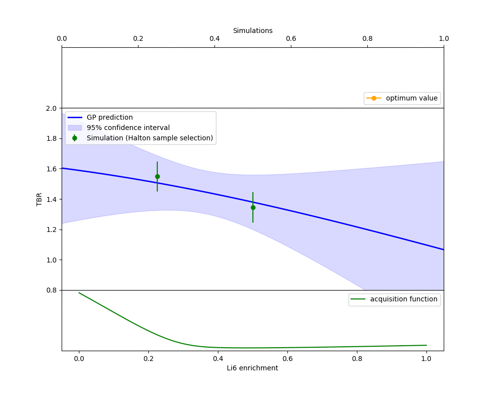</p>

&ensp; 
## --------------------------------------------------------------------------------------------------------------
&ensp; 

### <a name="task10"></a>Task 10 - Using CAD geometry

**This task is unavailable in Colab.**

Expected outputs from this task are in the [presentation](https://slides.com/openmc_workshop/neutronics_workshop#/23).

Constructive solid geometry (CSG) has been used in all the previous tasks. This task demonstrates the use of CAD geometry usage within openmc.

The use of CAD geometry has several advantages compared to CSG.

- Geometry containing complex shapes including spline curves can be modeled. This is essential for some fusion reactor designs (e.g. stellerators). 

- Geometry created outside of neutronics (e.g. design offices) is created in a CAD format. Using the CAD geometry directly avoids the manual process of converting CAD geometry into CSG geometry which is a bottleneck in the design cycle.

- Simulation reults such as heating can be mapped directly into engineering models which also use CAD geometry. This is benifitial when integrating neutronics into the design cycle or coupling neutronics with thermal

- Visulisation of neutronics models can be performed with CAD software which is mature and feature rich.

This taks depends on [DAGMC](https://svalinn.github.io/DAGMC/) and [FreeCAD](https://www.freecadweb.org/) both of which are installed on this docker image. 

The geometry can be viewed in FreeCAD. Open up FreeCAD by typing ```freecad``` in the command line.

Once loaded select file open and select blanket.stp, firstwall.stp and poloidal_magnets.stp. This should show the 3D model within the FreeCAD viewer. A tutorial of this is provided below.

**FreeCAD Video Tutorial**

<a href="http://www.youtube.com/watch?feature=player_embedded&v=pyZXQg0AsJ4
" target="_blank">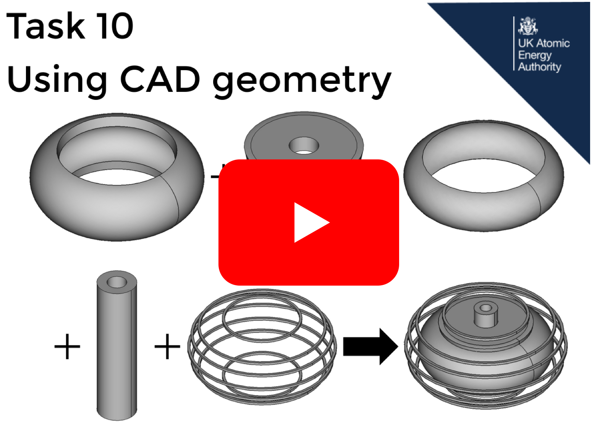</a>

If you have Trelis or Cubit installed (they can't be included on this Docker image) then try creating the DAGMC neutronics geometry using the command ```trelis make_faceted_geometry_with_materials```.

The trelis / cubit script will load up the stp files and combine them to create a faceted geometry that can be used in neutronics simulations. Feel free to explore the script and the coresponding json config file.

The next step is to open the OpenMC python script with the command ```coder example_CAD_simulation.py```.

Read throught the script and try to spot the differences between a CSG and CAD simulation script. You might notice that the materials are defined in the script but not assigned to volumes and that no geometry is made in the script. Also the settings object has an additional dagmc property

The material assignment is not required as this is perfomed when combining the stp files within the Trelis step. Trelis produces the dagmc.h5m file which contains geometry and each geometry is taged with a material name. These material names must be defined in the openmc script by it is not nessecary to assign them as this is taken care of by DAGMC.

Try running the script using the command ```python3 example_CAD_simulation.py```. This will run the simulation using the CAD geometry and produce the output results.

&ensp; 

### Acknowledgments
Fred Thomas for providing examples from previous years Serpent workshop,
Enrique Miralles Dolz for providing the CSG tokamak model, Andrew Davis for his work on the fusion neutron source, Chris Bowman for his Gaussian process software and the OpenMC team for their software.
