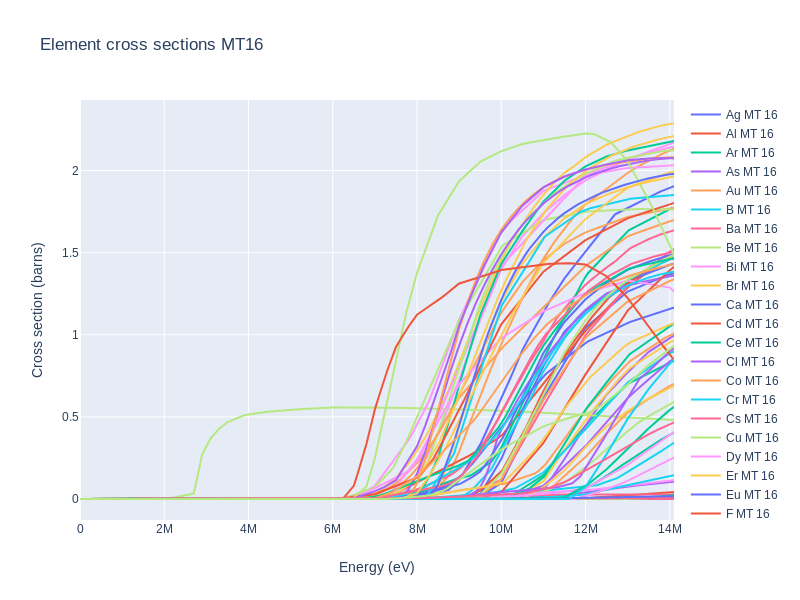
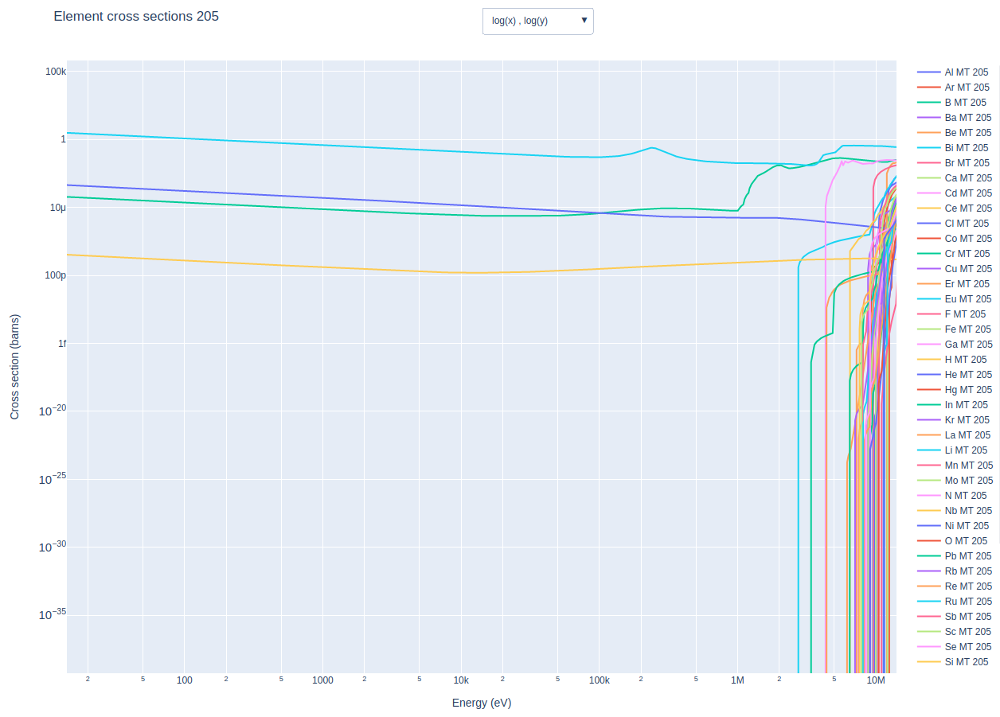

## <a name="task1"></a>Task 1 - Cross section plotting

Google Colab Link: [Task_1](https://colab.research.google.com/drive/1Z5C7bxX-1iPjBfhDrgIzGVaTyfI2CdFa)

Please allow 25 minutes for this task.

Expected outputs from this task are also in the [presentation](https://slides.com/openmc_workshop/neutronics_workshop/#/13).

Knowing the interaction probabilities of isotopes and materials in your model can help you understand simulation results. There are several online tools for plotting nuclear cross sections such as [www.xsplot.com](http://xsplot.com), however, OpenMC is also able to plot cross sections.

From inside the docker container navigate to the task_1 directory and open the first example python script using the commands below.

```cd tasks/task_1```

```coder 1_example_isotope_plot.py```

This script plots the cross sections of certain reactions for a selection of isotopes. OpenMC is well documented so if the script does not make sense take a look at the relevant [documentation](https://openmc.readthedocs.io/en/v0.10.0/examples/nuclear-data.html).

Run the script using the following command.

```python 1_example_isotope_plot.py```

You should see a plot of the n,2n cross sections for isotopes of lead and beryllium, as shown below.

<p align="center"></p>

To add different reactions to the plot we need their ENDF reaction numbers (MT numbers) which are available [here](https://www.oecd-nea.org/dbdata/data/manual-endf/endf102_MT.pdf).

- Try adding the other lead isotopes to the plot (Pb207 and Pb208).

The plot should now be similar to the plot below, showing fusion relevant interaction cross sections (change scale to log log). These are important reactions for breeder blankets as they offer high probability of neutron multiplication.

<p align="center"></p>

Elemental properties can also be found with OpenMC. 

- Try to understand the example code ```coder 2_example_element_plot.py```

- Try plotting neutron multiplication using the ```python 2_example_element_plot.py``` script.

This should produce a plot similar to the plot shown below.

<p align="center"></p>

-  Try changing the ```2_example_element_plot.py``` script so that it plots tritium production for all elements. Once produced you can change the axis scale (to log log) using the dropdown menu.

The tritium production should produce a plot similar to the plot shown below.

<p align="center"></p>

A nice feature of OpenMC is that it can plot cross sections for complete materials made from combinations of isotopes and elements. The ```3_example_material_plot.py``` script shows how to plot tritium production in Li4SiO4 which is a candidate ceramic breeder blanket material.

Materials are created in OpenMC by combining isotopes and elements either by 'atom percent' or 'weight percent'.
- Atom percent (percent_type='ao') - Proportion of total number of atoms in material of a particular type.
- Weight percent (percent_type='wo') - Proportion of material of a particular isotope or element by weight.

- Try running the script and producing the material cross section plot ```python 3_example_material_plot.py```

The plot produced should look similar to the plot shown below. As you can see lithium enrichment only increases tritium production at lower neutron energies.

<p align="center"></p>

 - Try editing the script so that other candidate breeder materials are added to the plot. ```coder 3_example_material_plot.py```

**Learning Outcomes**

- How OpenMC can be used to plot cross-sectional data for a variety of fusion-relevant interactions, e.g. (n,2n), (n,Xt). 
- Reaction probabilities vary for each isotope depending on the energy of the neutron. 
- Cross sections can be plotted for specific isotopes, elements and full materials. 
- Beryllium 9 has the lowest threshold energy for neutron multiplication reactions. 
- Lithium 6 has the highest probability of producing tritium at low neutron energies.
- Understand that lithium enrichment increases tritium production from low energy neutrons.