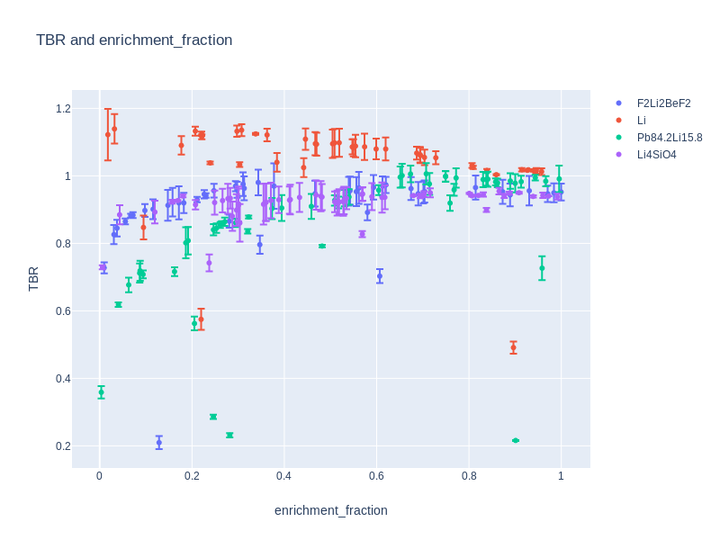
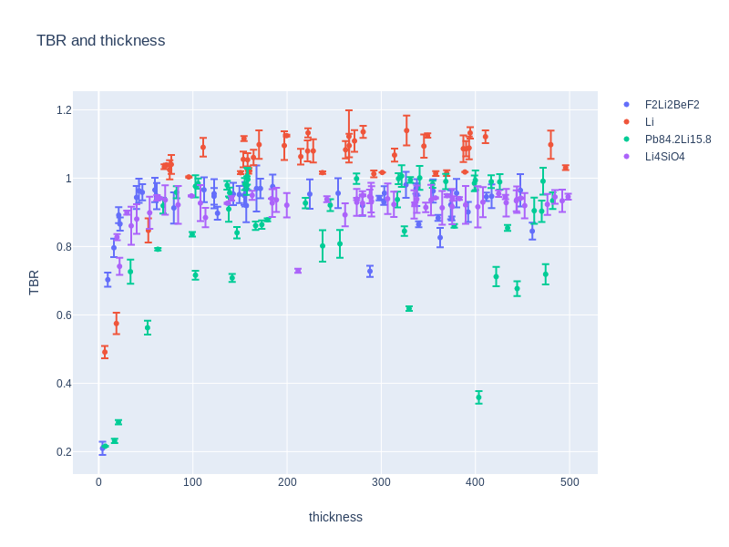
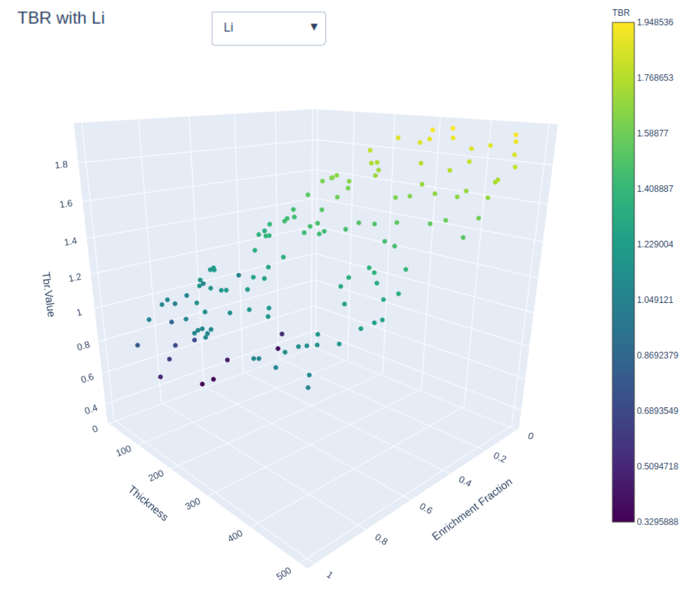

## <a name="task8"></a>Task 8 - Survey breeder blanket designs for tritium production

Google Colab Link: [Task_8](https://colab.research.google.com/drive/1fDOBm2YMojXVtucPQQ9XSjFqtzMibvjD)

Please allow 25 minutes for this task.

Expected outputs from this task are in the [presentation](https://slides.com/openmc_workshop/neutronics_workshop/#/20).

This task is more open ended - the aim is to find the minimum thickness of breeder material needed to obtain a TBR of 1.2. The scripts will need changing to make the serach more efficient as currently it just selects random points.

There are several candidate breeder materials including a lithium ceramic (Li4SiO4), Flibe, Lithium lead (eutectic) and pure lithium. Each material can have it's Li6 content enriched and the blanket thickness varied and these have an impact on the TBR.

Examine the ```simulate_tokamak_model.py``` file and try to understand how the model is created and particularly how the simulation parameters are saved in a json file with a unique ID.

- Currently the input parameters for Li6 enrichment and blanket thickness are randomly sampled so you might want to change this to speed up the search.

Run the script to perform simulations. There are two scripts to help you analyse the results.

- ```plot_simulation_results_2d.py``` will allow you to see the impact of changing either the Li6 enrichment or the blanket thickness on TBR.

- ```plot_simulation_results_3d.py``` will allow you to see the combined impact of changing the Li6 enrichment and the blanket thickness on TBR.

Ultimately you should come up with the minimum thickness needed for each candidate blanket material and the Li6 enrichment required at that thickness. Feel free to share simulation data with other groups and interpolate between the data points.

For 200 simulations, the 2D plots should look similar to the plots below.

<p align="center"></p>

<p align="center"></p>

For 525 simulations, the 3D plots should look similar to the example plot shown below.

<p align="center"></p>

**Learning Outcomes**

- A simple parameter study that makes use of unique ID's for each simulation.
- Some candiate breeder materials can meet the TBR requirment with a thinner blanket.
- Increasing the thickness of blanket or lthium 6 enrichment tend to increase the TBR but not for all materials.