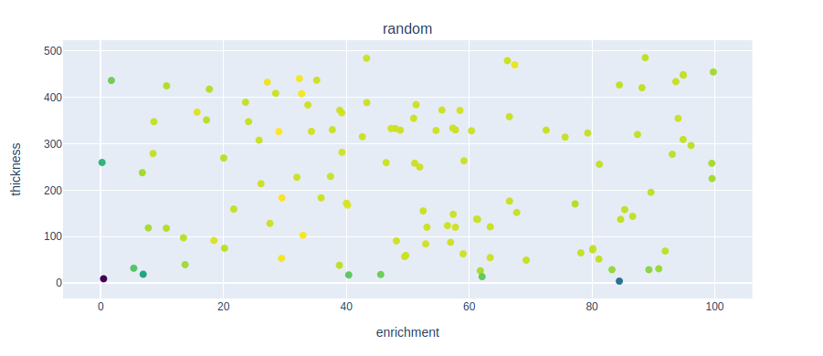
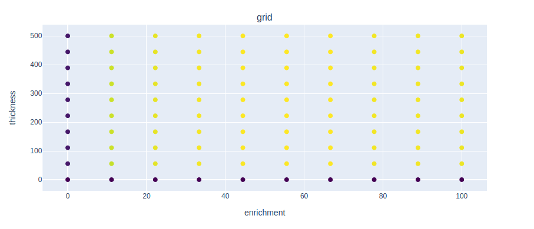

## <a name="task8"></a>Task 8 - Techniques for sampling parameter space

Google Colab Link: [Task_8](insert google colab link)

Please allow 25 minutes for this task.

Expected outputs from this task are in the [presentation](insert presentation list).

The aim of this task is to explore sampling techniques for performing simulations across a parameter space of interest.
A parameter space may be surveyed for several reasons. In the context of tritium breeding, this may be to measure the impact of a parameter on tritium breeding.

There are many ways to sample a parameter space, but some provide significant advantages to others.

In this task, we will use a simple tokamak model consisting of a central solenoid, shield and blanket, and perform simulations to measure the impact of varying blanket enrichment and thickness on TBR. Take a look at the ```openmc_model.py``` script to see the specific details of the model.

Using this model, simulations will be performed by varying blanket enrichment between 0 and 100%, and blanket thickness between 1cm and 500cm. These ranges define the 'parameter space' over which simulations will be performed. We will demonstrate a variety of sampling techniques to sample the parameter space and discuss the advantages and disadvantages of each in the context of simulations.

# Random Sampling

The easiest way to sample a parameter space is to use random sampling, where values are chosen at random from the parameter space.

Take a look at the ```1_simulate_with_random_sample.py``` script, which defines input parameters for the model defined in the ```openmc_model.py``` script. Try to understand how the values of enrichment and thickness are randomly varied.

Run the script using the command ```python3 1_simulate_with_random_sample.py```, using the -n flag to specify the number of simulations. The results of the simulations are saved in the 'outputs' folder of the task folder.

The task folder also contains a script called ```plot_sampling_coordinates.py``` which plots TBR as a function of thickness and enrichment for each sampling method. Run this script to plot the results of the random simulations. This should look similar to the plot below.

<p align="center"></p>

As shown, the simulations have been performed randomly across the parameter space of enrichment and thickness.

The main advantage of random sampling is that it is an 'unbiased' sampling technique, meaning simulations are performed across the entire parameter space at the same rate. This means that all simulations contribute to the overall data trend and additional simulations can be easily performed to increase accuracy.

However, random sampling is an inefficient way to sample a parameter space. As you can see, some points on the graph are very close together, meaning some simulations performed had very similar input parameters. This is inefficient because some simulations, therefore, provide little additional information about the overall trend, and the same results could be obtained from a smaller number of better-distributed simulations.

Overall, random sampling is a simple technique for performing unbiased simulations over a parameter space, however, its poor spatial distribution of sample points makes it a highly inefficient technique which wastes computational time.


# Grid Sampling

Another sampling technique is 'grid sampling', where samples are taken at regular grid intervals across the parameter space, see below. This is an example of 'biased sampling' as the samples are performed in order, according to the grid.

<p align="center"></p>

Open the ```2_simulate_with_grid_sample.py``` script and try to understand how a grid of enrichment and thickness values defines the input parameters for simulations; also note the order in which these simulations are performed.

Run the ```2_simulate_with_grid_sample.py``` script with the -n flag to specify the number of simulations and plot the results using the ```plot_sampling_coordinates.py``` script. Two graphs should be plotted showing the results for both random and grid simulations. Compare the two sampling methods.

<p align="center"></p>

As shown, grid sampling has a better spatial distribution of sample points than random sampling. Grid sampling maximises the spatial distribution of sample points across a parameter space and its use, therefore, maximises the amount of useful information obtained from each simulation. As a result, grid sampling is a highly efficient technique for covering a parameter space and performing simulations.

However, as the simulations are performed in an order according to the defined grid, they are biased towards the first parameter values of the grid. For example, ```2_simulate_with_grid_sample.py``` performs simulations with enrichment = 0 for all thicknesses before the enrichment is changed. This is a major disadvantage of grid sampling as it means all simulations across the grid must be performed before any data trend across the entire parameter space is be obtained. Therefore, more simulations may be performed than are necessary to obtain adequate results, leading to inefficiency. Random simulations, on the other hand, are unbiased meaning the data trend across the entire parameter space can be obtained 
RadAs a result, all simulations must be performed before a data trend across the entire parameter space can be obtained. Random simulations, on the other hand, are unbiased

Overall, grid sampling provides a much better spatial distribution of sample points across the parameter space than random sampling and is, therefore, a much more efficient sampling technique. However, its bias towards certain parameter values makes it unsuitable for most applications. Instead, 


Grid sampling is, therefore, not a good technique for sampling a parameter space. Instead, we 

As shown, the simulations performed 

The main advantage of grid sampling is that it maximises the spatial distribution of sample points across the parameter space. As shown, the parameter space of interest is covered by the s

SHOW A COMPARISON BETWEEN RANDOM AND GRID SAMPLING FOR THE SAME NUMBER OF POINTS.

As a result, the maximum amount of useful information is extracted from the smallest number of simulations.This maximises the spatial distribution of sample points across the parameter space meaning This is an example of a 'biased' sampling technique as the 

Instead of randomly sampling a parameter space, we can perform a 'grid sample'. This is where samples of the parameter space are taken in a regular grid

An alternative sampling technique is 'grid sampling', where samples of a parameter space are taken in a regular grid

Instead of randomly sampling a parameter space, we can perform a grid sample. This is where samples will be taken in a regular grid over the parameter space. This provides maximum spatial distribution of the points, meaning the maximum amount of useful information is extracted from the smallest number of simulations.

```2_simulate_with_grid_sample.py```

The problem with grid sampling, however, is that the simulations are performed in order.
This means there is a bias towards the first simulations and we need to wait for all simulations to be performed before an overall trend across the whole parameter space can be seen.
Also makes it difficult to perform additional simulations as you would have to track where the grid search has got up to.
Therefore, ideally, we would use a sampling technique that had elements of a random nature such that simualations are unbiased, but still have a good spatial distribution.

Run the script.
These outputs are saved in the same output folder as any previously run simulations, however, the output files contain a tag showing the sampling techique used to perform the simulation.
Running the plotting script again, the plotting script will now plot the results by grouping the results for each sampling technique separately.
Run this script to compare grid sampling and random sampling.


# Halton Sampling

Halton sampling is a sampling technique based on the halton sequence. This sequence is a quasi-random number sequence based on coprime numbers.
More information can be found here, but what is most important to know is that Halton sampling allows parameter space to be covered more efficiently.

```3_simulate_with_halton_sample.py```


Maybe use some of these
- Some candiate breeder materials can meet the TBR requirment with a thinner blanket.
- Increasing the thickness of blanket or lthium 6 enrichment tend to increase the TBR but not for all materials.
- Random slection of parameters is not an efficient way of covering the search space or finding the optimal.