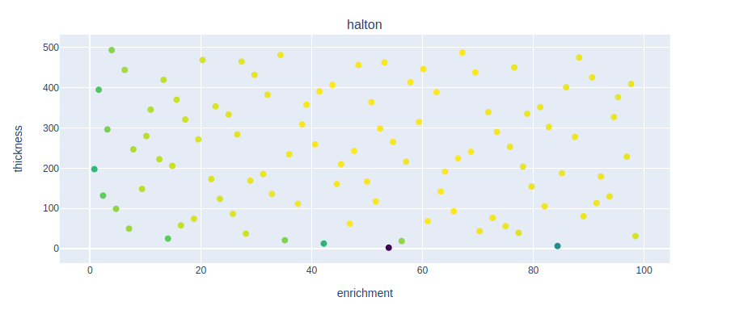

## <a name="task8"></a>Task 8 - Techniques for sampling parameter space

Google Colab Link: [Task_8](insert google colab link)

Please allow 25 minutes for this task.

Expected outputs from this task are in the [presentation](insert presentation list).

The aim of this task is to explore sampling techniques for performing simulations across a parameter space of interest.
A parameter space may be surveyed for several reasons. In the context of tritium breeding, this may be to measure the impact of a parameter on tritium breeding.

There are many ways to sample a parameter space, but some provide significant advantages to others.

In this task, we will use a simple tokamak model consisting of a central solenoid, shield and blanket, and perform simulations to measure the impact of varying blanket enrichment and thickness on TBR. Take a look at the ```openmc_model.py``` script to see the specific details of the model.

Using this model, simulations will be performed by varying blanket enrichment between 0 and 100%, and blanket thickness between 1cm and 500cm. These ranges define the 'parameter space' over which simulations are performed. We will demonstrate a variety of sampling techniques to sample the parameter space and discuss the advantages and disadvantages of each.

# Random Sampling

The easiest way to sample a parameter space is to use random sampling, where values are chosen at random from the parameter space.

Take a look at the ```1_simulate_with_random_sample.py``` script, which defines input parameters for the model defined in the ```openmc_model.py``` script. This script calculates TBR for given values of enrichment and thickness. Try to understand how the values of enrichment and thickness are randomly varied.

Run the script using the command ```python3 1_simulate_with_random_sample.py```, using the -n flag to specify the number of simulations. The results of the simulations are saved in the 'outputs' folder of the task directory.

The task folder also contains a script called ```plot_sampling_coordinates.py``` which plots TBR as a function of thickness and enrichment for each sampling method. Run this script to plot the results of the random simulations. This should look similar to the plot below.

<p align="center"></p>

As shown, the simulations have been performed randomly across the parameter space of enrichment and thickness.

The main advantage of random sampling is that it is an 'unbiased' sampling technique, meaning simulations are performed across the entire parameter space at the same rate. This means that all simulations contribute to the overall data trend and additional simulations can be easily performed to increase accuracy.

However, random sampling is an inefficient sampling technique. As you can see, some points on the graph are very close together, meaning some simulations performed had very similar input parameters. This is inefficient because some simulations, therefore, provide little additional information about the overall trend, meaning the same results could have been obtained from a smaller number of simulations.

Overall, random sampling is a simple technique for performing unbiased simulations over a parameter space, however, its poor spatial distribution of sample points makes it a highly inefficient technique.

# Grid Sampling

Another sampling technique is 'grid sampling', where samples are taken at regular grid intervals across the parameter space, as shown below. This is an example of 'biased sampling' as the samples are performed in order according to the grid.

<p align="center"></p>

Open the ```2_simulate_with_grid_sample.py``` script and try to understand how a grid of enrichment and thickness values defines the input parameters for the simulations; also note the order in which these simulations are performed.

Run the ```2_simulate_with_grid_sample.py``` script with the -n flag to specify the number of simulations and plot the results using the ```plot_sampling_coordinates.py``` script. Two graphs should be plotted showing the results for both random and grid simulations. Compare the two sampling methods.

<p align="center"></p>

As shown, grid sampling has a better spatial distribution of sample points than random sampling. Grid sampling maximises the spatial distribution of sample points across a parameter space and, therefore, maximises the amount of useful information obtained from each simulation. As a result, grid sampling is a highly efficient sampling technique for covering a parameter space.

However, as simulations are performed in order according to the defined grid, they are biased towards the first parameter values. For example, ```2_simulate_with_grid_sample.py``` performs simulations with enrichment = 0 for all blanket thicknesses before enrichment is changed. This means that all simulations across the grid must be performed before a data trend across the entire parameter space is obtained. This is the major disadvantage of grid sampling because more simulations may be performed than are necessary, because the data trend cannot be seen until the end, and it is difficult to add sample points to the existing data set. On the other hand, random sampling is unbiased meaning the data trend across the parameter space can be observed with a small number of simulations and additional data points can be added easily.

Overall, grid sampling provides a much better spatial distribution of sample points across the parameter space than random sampling and is, therefore, a more efficient sampling technique. However, its bias towards initial parameter values makes it unsuitable for most applications. Instead, we tend to use 'quasi-random' sampling techniques which combine the spatial efficiency and randomness.

# Halton Sampling

Halton sampling is a quasi-random sampling technique based on the [halton sequence](link). Using a [quasi-random number sequence](link) based on coprime numbers, halton sampling allows a parameter space to be sampled both efficiently and with a element of random nature. Like random sampling, halton sampling allows data trends across the parameter space to be observed with a small number of samples, but distributes the sample points more efficiently throughout the parameter space.

Open the ```3_simulate_with_halton_sample.py``` script and try to understand how the halton sequence is used to generate inputs for the simulation.

Run this script and plot the results. The graph should look similar to the plot below.

<p align="center"></p>

As you can see, the sample points have a much better spatial distribution across the parameter space than random sampling.

This means that each simulation extracts a large amount of information about the overall data trend 
Simulation points are not close together so they are not wasted
Efficient sampling technique for surveying an entire parameter space.

The disadvantage of halton sampling is that it still surveys the entire parameter space when we only really want to survey the part of the parameter space where the important data trend is. 
This is where we could use optimised sampling or adaptive sampling to further increase the efficiency of simulations.


Maybe use some of these
- Some candiate breeder materials can meet the TBR requirment with a thinner blanket.
- Increasing the thickness of blanket or lthium 6 enrichment tend to increase the TBR but not for all materials.
- Random slection of parameters is not an efficient way of covering the search space or finding the optimal.